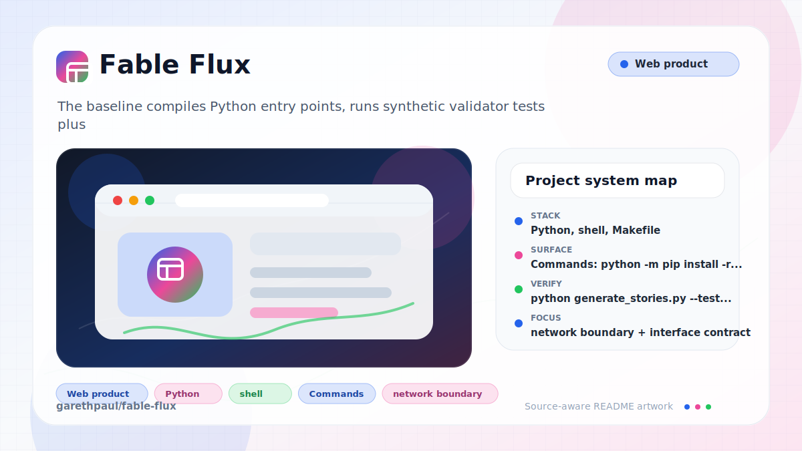

# Fable Flux

<!-- README-OVERVIEW-IMAGE -->


Fable Flux is an AI-assisted educational story pipeline. The repository contains
Python tools for generating and validating children's educational stories,
Hugging Face dataset upload helpers, Modal/vLLM serving configuration, and a
Next.js frontend that proxies story requests to a Modal-hosted model.

## Repository Contents

- `src/` - Python generation, validation, diversity tracking, and dataset upload code
- `config/generation_config.yaml` - generation ranges, model choices, retry limits, and quality thresholds
- `data/stories/` - checked-in source story corpus
- `output/generated_stories/` - generated story artifacts that are already tracked in this repo
- `serving/main.py` - Modal web server for the Fable Flux fine-tuned model
- `front-end/` - Next.js app and API proxy for interactive story generation
- `scripts/check-baseline.sh` - offline baseline verification used for maintenance changes

## Setup

Use Python 3.7 or newer for the generation tools.

```bash
python3 -m venv .venv
source .venv/bin/activate
python -m pip install -r requirements.txt
```

Copy `.env.example` to `.env` or export the values in your shell. Real tokens
must stay out of git.

Required environment variables:

- `POE_API_KEY` for Python story generation through Poe
- `HF_TOKEN` for Hugging Face dataset uploads
- `MODAL_API_KEY` and `MODAL_API_URL` for the frontend proxy
- `MODAL_MODEL` when the Modal served model name differs from the default

## Story Generation

Run a small Poe-backed test batch:

```bash
python generate_stories.py --test --size 5
```

Run a specific range:

```bash
python generate_stories.py --batch 1501 1510
```

Generated progress and logs are local runtime artifacts. Avoid committing new
logs, virtual environments, cache files, or generated outputs unless they are
intentional fixtures for review.

## Dataset Upload

Upload parsed story data to Hugging Face:

```bash
python upload_to_huggingface.py --quick --repo-name username/children-stories-dataset --private
```

The uploader converts markdown story files into JSONL and writes temporary
artifacts under `output/huggingface/`.

## Frontend

```bash
cd front-end
npm install
cp .env.local.example .env.local
npm run dev
```

The API route at `front-end/src/app/api/chat/completions/route.ts` reads
`MODAL_API_KEY`, `MODAL_API_URL`, and optional `MODAL_MODEL` on the server. It
validates prompt length, requires an HTTPS Modal endpoint with a hostname, and
avoids logging raw upstream story content.

The Python Poe client also omits raw upstream response bodies from parse and
HTTP error logs; it records response length instead.

Story markdown must use mapping-shaped YAML frontmatter. Sequence, scalar, or
empty frontmatter is rejected by both quick and full validation before quality
checks run.

## Verification

Run the offline baseline:

```bash
make check
```

The baseline compiles Python entry points, runs synthetic validator tests plus
offline diversity and prompt tests, performs static frontend proxy checks, and
runs frontend lint when `front-end/node_modules` is present. It also guards
frontmatter parsing and quick validation so malformed metadata does not reach
story quality checks.

Run frontend checks after touching the app:

```bash
cd front-end
npm run lint
npm run build
```

## Security And Privacy

- Never commit Poe, Hugging Face, Modal, or model-serving credentials.
- Do not log prompts, generated stories, user inputs, or raw model responses
  unless there is a specific reviewed need.
- Keep story safety, age appropriateness, and educational value validation in
  place for generation changes.
- Treat public dataset and model claims as reproducible artifacts tied to
  checked-in configuration.

See `SECURITY.md` for reporting guidance and `VISION.md` for project guardrails.
